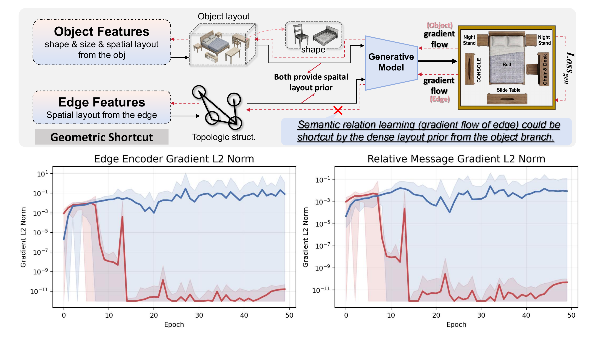
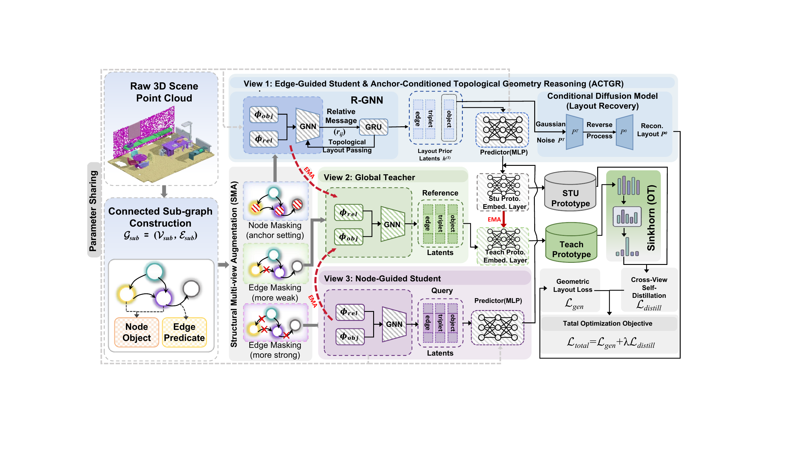

# ToLL-SGG

Official code release for **ToLL: Topological Layout Learning with Asymmetric Cross-View Structural Distillation for 3D Scene Graph Generation Pretraining**.

This repository is organized around the two stages used in the paper:

- `pretraining/`: topology-aware 3D scene graph pretraining, including the ACTGR/ToLL++ layout restoration branch and the SMA structural distillation branch.
- `finetuning/`: downstream 3D scene graph generation modules and fine-tuning configuration.

## Motivation

<p align="center">
  
</p>

Dense object-level layout priors can provide a shortcut for reconstructive 3D scene graph pretraining: the generative objective may be optimized through object shape, size, and absolute spatial priors while the edge/message branch receives weak learning signals. The gradient analysis above shows that edge-aware reasoning can be suppressed when the model bypasses topology, motivating ToLL to impose a single-anchor bottleneck and learn layout recovery through topological message passing.

## Main Architecture

<p align="center">
  
</p>

ToLL builds connected subgraphs from raw 3D scenes and trains the encoder with complementary structural views. The edge-guided student view performs Anchor-Conditioned Topological Geometric Reasoning (ACTGR), where a recurrent relational GNN propagates relative geometric messages from a single anchor and a conditional diffusion model restores the masked layout. The global teacher and node-guided student views form the Structural Multi-view Augmentation (SMA) branch, where prototype-based Sinkhorn assignments provide cross-view self-distillation. The final objective combines geometric layout recovery with structural distillation.

## Repository Layout

```text
ToLL-SGG/
  assets/
    motivation.png
    architecture.png
  pretraining/
    main_diff.py                 # ACTGR + ToLL++ layout restoration pretraining
    main_swav.py                 # SMA / SwAV-style structural distillation pretraining
    src_diff/                    # diffusion layout restoration implementation
    src_swav/                    # structural multi-view distillation implementation
    configs/
    scripts/
  finetuning/
    main.py
    src/                         # downstream 3DSGG / SGFN-MMG modules
    configs/
    scripts/
  data/
    3DSSG_subset/                # lightweight label and split metadata
  data_processing/
  third_party/KNN_CUDA/
```

## Installation

Create a Python environment with PyTorch, CUDA, and the common 3D learning dependencies:

```bash
conda create -n toll-sgg python=3.10 -y
conda activate toll-sgg
pip install -r requirements.txt
pip install -e third_party/KNN_CUDA
```

The code uses PyTorch, PyTorch Geometric, timm, tensorboard, tqdm, scipy, scikit-learn, trimesh/open3d-style 3D utilities, and the custom KNN CUDA extension. Please install PyTorch and PyTorch Geometric versions matching your CUDA toolkit.

## Data Preparation

Prepare the raw datasets outside this repository, then update the config paths:

- ScanNet pretraining subgraphs: set `root_ScanNet` and `json_path` in `pretraining/configs/tollpp_scannet.json`.
- 3RScan/3DSSG fine-tuning and SMA pretraining: set `dataset.root_3rscan` in `pretraining/configs/toll_sma_3dssg.json` and `finetuning/configs/mmgnet.json`.
- Optional text/Atlas embeddings: set `SCANNET_TEXT_EMB_PATH` or `ATLAS_EMBEDDING_PATH` if you use those branches.

The repository includes lightweight 3DSSG label and split metadata under `data/3DSSG_subset/`. Raw point clouds, ScanNet scans, 3RScan meshes, embeddings, and checkpoints are intentionally not committed.

## Model Zoo

Replace the placeholders below with the final public links before release.

| Name | Usage | Link |
| --- | --- | --- |
| PointDif object encoder init | optional initialization for `MASK_ENCODER_INIT_PATH` | `<TODO: add public link>` |
| ToLL pretraining checkpoint | initialize downstream 3DSGG encoders | `<TODO: add public link>` |
| 3DSSG fine-tuned checkpoint | reproduce downstream results | `<TODO: add public link>` |

## Pretraining

ACTGR + ToLL++ layout restoration:

```bash
bash pretraining/scripts/train_tollpp_scannet.sh \
  pretraining/configs/tollpp_scannet.json
```

SMA structural multi-view distillation:

```bash
NPROC_PER_NODE=2 MASTER_PORT=29501 \
bash pretraining/scripts/train_toll_sma_3dssg.sh \
  pretraining/configs/toll_sma_3dssg.json
```

See [pretraining/README.md](pretraining/README.md) for the module-level mapping to the paper.

## Fine-tuning

Set `MODEL.use_pretrain` in `finetuning/configs/mmgnet.json` to a ToLL checkpoint, then run:

```bash
bash finetuning/scripts/train_3dssg.sh finetuning/configs/mmgnet.json
```

The fine-tuning folder keeps the downstream SGFN-MMG style modules used for 3D Scene Graph Generation. See [finetuning/README.md](finetuning/README.md) for configuration notes.

## Citation

```bibtex
@article{toll_sgg,
  title={ToLL: Topological Layout Learning with Asymmetric Cross-View Structural Distillation for 3D Scene Graph Generation Pretraining},
  author={TODO},
  journal={TODO},
  year={2026}
}
```

## Acknowledgements

This project builds on common 3D scene graph generation, Point-MAE/PointDif-style point cloud modeling, and SwAV-style self-distillation components. Please also cite the original datasets and dependencies used in your experiments.
